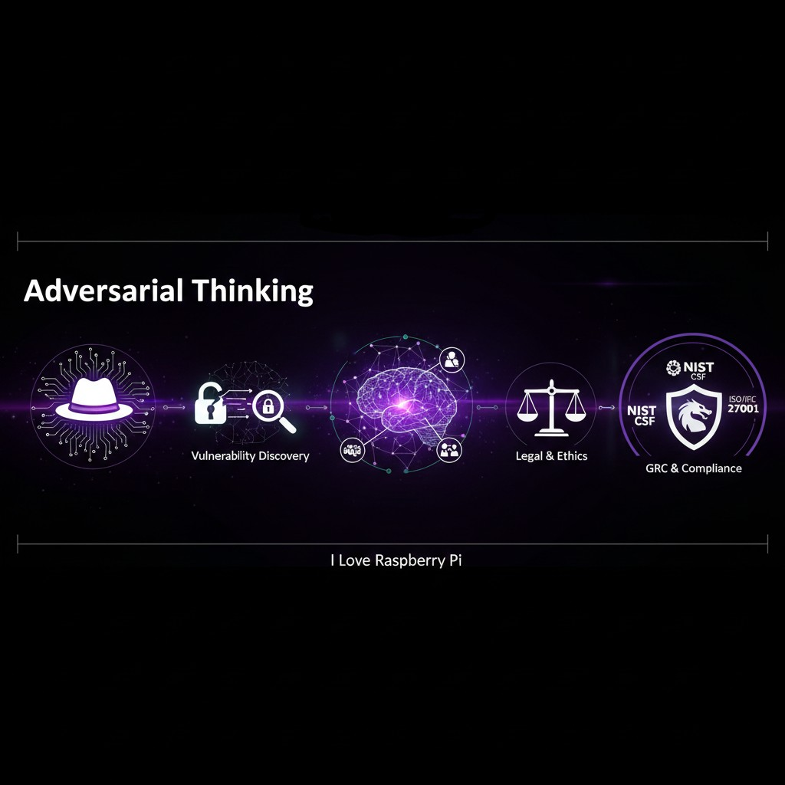

# AdversarialThinking
I don't just read about security; I build and break it to understand the "why" behind the controls. This repository documents my journey through system hardening, network defense, penetration testing, governance, risk, and compliance.

### Attributions
The Kali Linux and Kali Purple logos are trademarks of OffSec. This project uses these assets for educational and identification purposes under open-source community guidelines and under "fair use."
